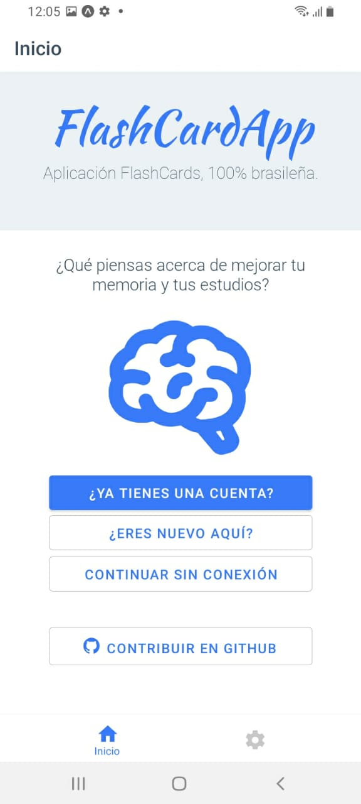
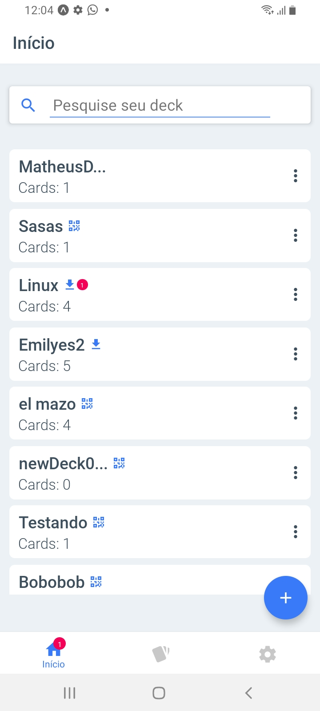
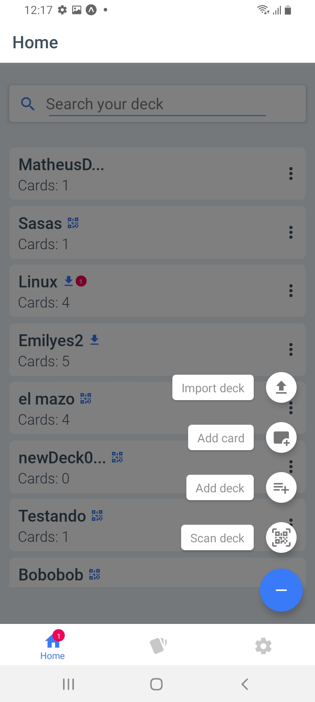
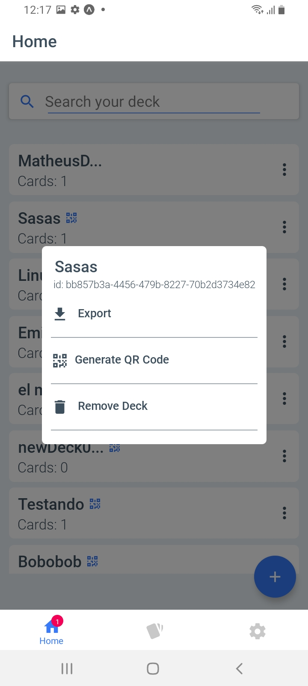
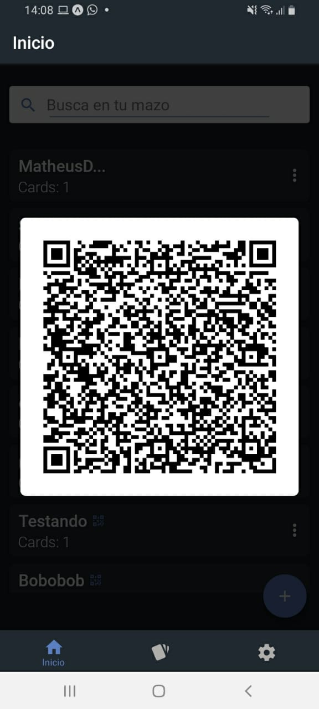
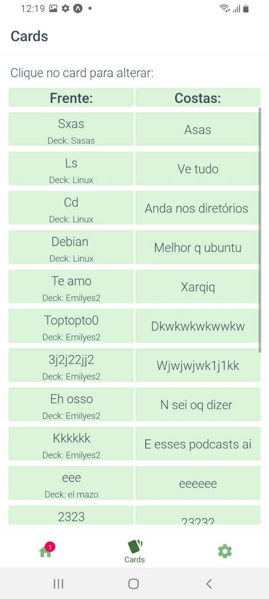
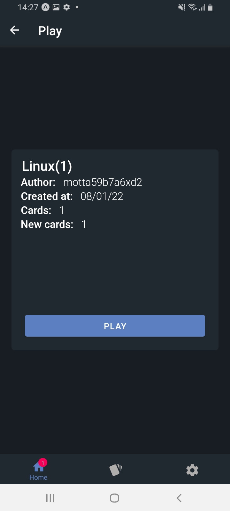
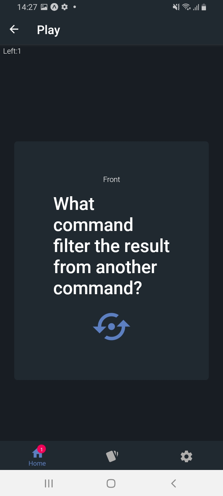
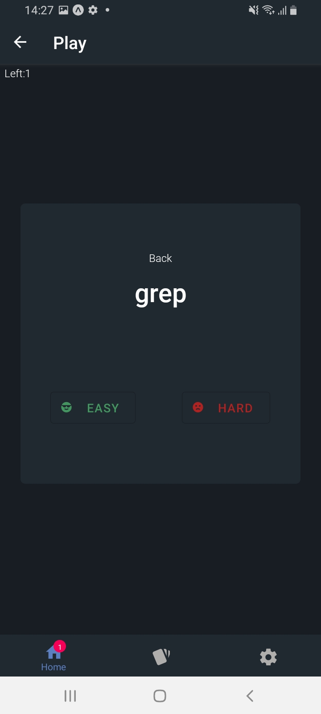
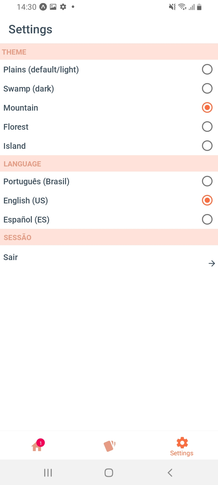

# FlashCardApp 
> A flashcard app, to help in your studies and memory.


## About

The ideia about app have came after the will from build a react-native app and the reminder from me using Anki when younger.
That dont looked like a so hard app to make in a shorter time period, so I thought, why not? The result is it. And when I say "it dont looked like a so hard app" I means: using expo and react-native, of course. Maybe if it was a native app, build in kotlin or swift, it was harder.

The first idea was build a frontend with React-Native and the backend with NodeJS. The backend is being building, but in a slower way. You can see the backend [here](https://github.com/matheusxreis/flashcard-api), but it is not connected with the app yet.

Looking forward to seeing as soon as possible the result, because I'm like that and the college would start in one week, I taked the decision that "the backend could wait".

To build just the frontend was necessary think about a way to store and share the data that needed to be save. I choosen two ways to do this: a way to share whole decks using qr code and a way to import and export a file containing a whole deck. This way, the user can share easily a deck with a friend, and save them in another place without filling up the phone's memory.

So, for while, it is just a offline app and the authentication using the NodeJS API is not working. But, soon it is change. 

That was a short story from how I decided to build this app and why its storage is only local, without a backend. Sorry if it was boring, and thanks if you read until here.

## Technologies

- **React Native and Expo**: the tools which I used to build the app. They was the chosen, because I had little time and I'm very used to use them;
- **Redux**: the state manager from the my heart, which is with me and all react project I do;
- **React Native Paper**: the design library used to make some components. It was my first time using;
- **i18next**: to internationalization. The app is avaible in three languages: Portuguese (Brazil), English (US) and Spanish (Spain);
- **React Navigation**: the library to do the app's navigation;
- **Typescript**: I think since typescript, there is no how to not use it.

## Running the app:

To run the app, you must follow the next steps:

```bash
    
    git clone https://github.com/matheusxreis/flashcard-app ##cloning the project
    yarn  ## downloading the dependencies
    expo start ## running the expo 
    a #for android
    i #for ios

```

## Screens:

### Authentication:

The ideia is that there is two options to sign in: for who has a account and for who has not. 




### Home:

When into app, the first screen is the home, which contains a list of user's deck and some options to him.

<div style="display:flex">
    
    
</div>
Here is where the user can generate a qr code or export his deck to share with friend or for himself storage. 
<div style="display:flex">
     
    
</div>
### Cards:

The screen where the user can remove, edit and see all his cards in app. 



### Play:

This is the screen where the app's main objective happens. The game occurs here. 
The user can see his flashcards through this screens.

<div style="display:flex">
        
        
        
</div>
### Settings:

How the name says: the settings screen. The user can control the theme, the language and the session here.



 I really had fun coding this application and I'm happy with the result. Obviously has so much to improve and I'll trying to do better when I realize that it needs. It is under development, but what is not? A good software never stop to be developed. 

 That's all folks! Never stop learning! :metal: